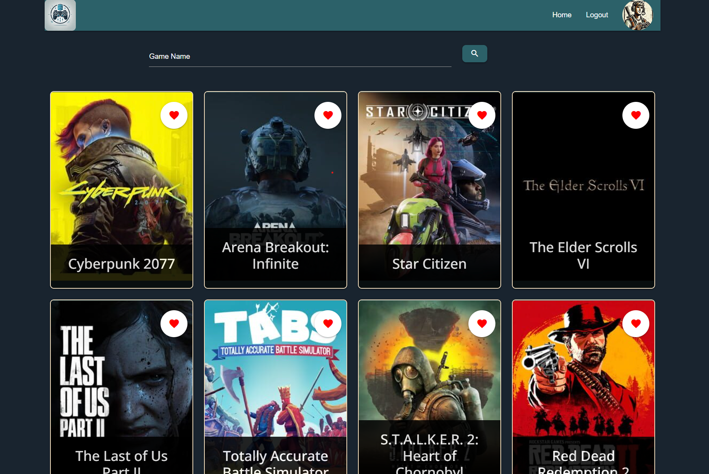
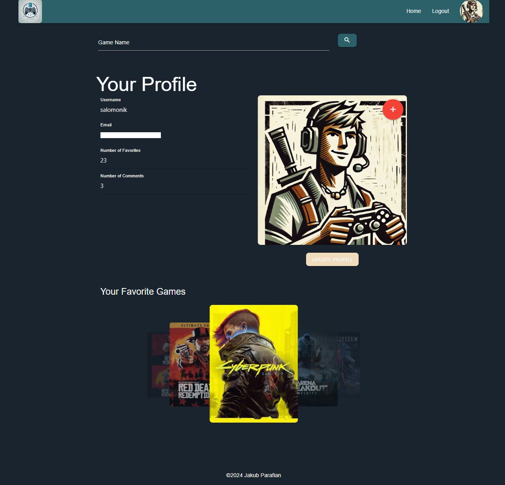

<br>

### The live link can be found here - [Game Central](https://milestone-project-3-jp-49f0065fdfbf.herokuapp.com/)

# Game Central

## Description

**Game Central Collection** is a comprehensive video game database website designed to allow users to explore and manage video game information. The site integrates with the IGDB API to fetch a vast collection of video games and leverages a PostgreSQL database to store additional user data and interactions. Key functionalities include browsing games, viewing detailed game information, managing user profiles, and maintaining a list of favorite games.

The application is built using Flask for the backend, SQLAlchemy for ORM, and is styled with Materialize CSS. It is deployed on Heroku, ensuring scalability and ease of access.

The main objective of Game Central Collection is to provide gamers with an extensive and easy-to-navigate platform to discover and keep track of their favorite games.

## Site Owner Goals

As the owner of Game Central Collection, the primary goals of the site are:

1. **Provide a Comprehensive Database**: Offer a wide range of video games with detailed information fetched from the IGDB API, ensuring that users have access to up-to-date and accurate data.

2. **Enhance User Engagement**: Create a user-friendly and interactive platform that encourages users to explore, discover, and interact with game information. This includes features such as game browsing, detailed game pages, and user comments.

3. **User Management and Personalization**: Allow users to create accounts, log in, and manage their profiles. Enable users to personalize their experience by adding games to their favorites list and leaving comments on game pages.

4. **Community Building**: Foster a sense of community among users by providing features that allow for interaction and sharing of opinions about different games. The ability to comment on games helps build this community aspect.

5. **Responsive Design**: Ensure the site is accessible and easy to use on both desktop and mobile devices, providing a seamless experience for all users.

6. **Scalability and Performance**: Utilize scalable technologies such as Heroku for deployment and PostgreSQL for data storage to handle growing user numbers and ensure the site performs well under load.

7. **Security**: Implement robust security measures to protect user data, including secure authentication, data encryption, and CSRF protection.

## Development Life Cycle

### Project Planning

During the project planning phase, the following steps were undertaken to ensure a structured and well-organized development process for Game Central Collection:

1. **Requirements Gathering**:

   - Identified the primary goals and objectives of the project.
   - Defined the core features and functionalities required for the application, including game browsing, user authentication, favorites management, and commenting.

2. **Research and Analysis**:

   - Conducted research on available APIs for video game data, selecting the IGDB API for its comprehensive dataset and reliable performance.
   - Analyzed similar existing platforms to identify best practices and potential areas for improvement.

3. **Technical Planning**:

   - Chose the Flask framework for backend development due to its simplicity and flexibility.
   - Selected PostgreSQL as the database system for its robustness and compatibility with Heroku.
   - Decided on using Materialize CSS for frontend design to ensure a responsive and modern user interface.

4. **Wireframing and Prototyping**:

   - Created wireframes and prototypes to visualize the layout and user flow of the application.
   - Gathered feedback on the prototypes to make necessary adjustments before starting development.

5. **Task Breakdown and Timeline**:

   - Broke down the project into manageable tasks and milestones.
   - Established a timeline for development, setting deadlines for each phase of the project.

6. **Setting Up the Development Environment**:
   - Configured version control using Git and set up a repository on GitHub.
   - Established a development environment with necessary tools and libraries, including virtual environments, required Python packages, and database configurations.

### Content Requirements

_Pages and Features_

1. **Home Page**:

   - Introduction to the site and its main features.
   - Search bar for users to search for games by name.
   - Display of popular games.

2. **Game Details Page**:

   - Detailed information about a specific game, including:
     - Name
     - Description
     - Release date
     - Cover image
     - User comments
   - Option to add the game to the user's favorites list (if logged in).

3. **User Profile Page**:

   - Display user information, including username and email.
   - List of the user's favorite games.
   - Option to update profile picture.

4. **Login Page**:

   - Form for users to log in with their email and password.

5. **Registration Page**:
   - Form for new users to sign up with their username, email, and password.
   - Validation for unique usernames and emails.

### Development Life Cycle

## Development

1. **Setting Up Flask Application**:
   - Initialized a Flask application.
   - Configured the app with necessary settings including the database and CSRF protection.
2. **Defining Database Models**:
   - Created SQLAlchemy models for `User`, `Game`, `Comment`, and a many-to-many relationship `favorites`.
3. **API Integration**:
   - Integrated with the IGDB API to fetch and display game data.
4. **Frontend Development**:
   - Created HTML templates using Jinja2 templating engine.
   - Utilized Materialize CSS framework for styling and responsiveness.

## Requirements

### Functional Requirements

1. **User Authentication**:

   - Users should be able to register, log in, and log out.
   - Registered users should have a unique username and email.
   - Passwords should be hashed and stored securely.

2. **User Profile**:

   - Users should be able to view and update their profile, including changing their avatar.
   - Profiles should display the number of favorite games and comments made by the user.
   - Users should be able to view the profiles of other users.

3. **Game Search and Display**:

   - Users should be able to search for games by name.
   - The application should display game details including name, genres, platforms, release dates, and summary.
   - Game data should be fetched from the IGDB API.

4. **Favorites Management**:

   - Users should be able to add games to their favorites.
   - Users should be able to view their list of favorite games.
   - Users should be able to remove games from their favorites.

5. **Comments**:

   - Users should be able to add comments to game pages.
   - Users should be able to edit and delete their own comments.
   - Comments should be displayed in chronological order on the game detail page.

6. **Home Page**:

   - The home page should display a list of popular games.
   - Each game on the home page should link to its detail page.

7. **Game Details Page**:

   - The game details page should display detailed information about the game.
   - The page should also show user comments and a form to add new comments.
   - Users should be able to toggle a game as a favorite from the game details page.

8. **Responsive Design**:

   - The application should be responsive and work well on both desktop and mobile devices.
   - The layout should adjust to different screen sizes, providing a good user experience on all devices.

9. **Error Handling**:

   - The application should handle errors gracefully.
   - Users should see user-friendly error messages if something goes wrong, such as failing to fetch data from the API or trying to access a page that doesn't exist.

10. **Security**:
    - CSRF protection should be implemented to prevent cross-site request forgery.
    - User input should be validated to prevent SQL injection and other security issues.

### Non-Functional Requirements

1. **Performance**:

   - Database queries should be optimized for fast retrieval of data.

2. **Reliability**:

   - The application should have minimal downtime.

3. **Usability**:

   - The user interface should be intuitive and easy to navigate.
   - Forms and other interactive elements should provide clear feedback to the user.

4. **Security**:

   - Sensitive data, such as user passwords, should be encrypted.
   - The application should be protected against common security threats, such as SQL injection, XSS, and CSRF.

5. **Accessibility**:
   - It should follow accessibility guidelines, such as providing alt text for images and ensuring good contrast between text and background colors.

### Out of Scope

The following features are not included in the current scope of the Game Central Collection project:

1. **Displaying All Comments on User Profiles**:

   - User profiles do not display a list of all comments made by the user.

2. **Liking Comments**:
   - The functionality to like or upvote comments is not available.

## User Experience

### User Stories

1. **As a visitor**, I want to be able to search for video games by name so that I can find information about my favorite games.
2. **As a visitor**, I want to view detailed information about a game, including its description, release date, genres, and platforms.
3. **As a visitor**, I want to be able to register for an account so that I can save my favorite games and leave comments.
4. **As a registered user**, I want to be able to log in and log out of my account.
5. **As a registered user**, I want to update my profile information, including changing my avatar.
6. **As a registered user**, I want to be able to add games to my list of favorites.
7. **As a registered user**, I want to be able to view and manage my list of favorite games.
8. **As a registered user**, I want to leave comments on game detail pages.
9. **As a registered user**, I want to edit and delete my own comments.
10. **As a registered user**, I want to be able to view the profiles of other users to see their favorite games.

**Returning User Experience**

1. **Seamless Login**:

   - Returning users can easily log in to their accounts using their registered email and password.

2. **Profile Management**:

   - Returning users can view and update their avatar.
   - Users can see a summary of their activity, such as the number of favorite games and comments made.

3. **Favorites Management**:

   - Returning users can view their list of favorite games from their profile page.
   - They can add new games to their favorites or remove games they are no longer interested in.

4. **Comment Interaction**:

   - Returning users can view their past comments on game detail pages.
   - They have the ability to edit or delete their own comments, ensuring their feedback stays relevant and accurate.

5. **Game Search and Discovery**:

   - Users can continue to search for new games using the search functionality.
   - Popular games and new additions are displayed on the home page, providing users with new content to explore.

6. **Personalized Experience**:
   - Notifications or flash messages can inform users of successful actions, such as adding a game to favorites or updating profile information.

## Design

### Color Scheme

The color scheme is designed to be visually appealing and easy on the eyes. It uses a combination of primary, secondary, and background colors to create a consistent and cohesive look throughout the application.

- **Primary Color**: `#F1DCBC`
- **Secondary Color**: `#2C6169`
- **Background Color**: `#19242F`
- **Text Color**: `white`

### Typography

The application uses the following fonts:

- **Header Font**: 'Helvetica Neue', sans-serif
- **Body Font**: 'Arial', sans-serif
- **Title Font**: 'Open Sans', sans-serif

These fonts are chosen to ensure readability and a modern look.

### Layout

The layout of the application is responsive and adapts to different screen sizes. The design principles followed include:

- **Max Width**: The maximum width of the container is set to `1200px`.
- **Padding and Margin**: Consistent padding and margin are applied throughout the application for a balanced layout.
- **Border Radius**: Rounded corners are applied to elements using a border radius of `8px`.
- **Box Shadow**: A subtle box shadow is used to add depth to the elements.

## Wireframe

<details>
<summary>Wireframe</summary>

<details>

<summary>Main Page</summary>


</details>

<details>
<summary>Game Details</summary>


</details>

<details>
<summary>Profile</summary>


</details>

</details>

## Screenshots

<details>
<summary>Screenshots</summary>

<details>

<summary>Main Page</summary>




</details>

<details>
<summary>Game Details</summary>


</details>

<details>
<summary>Profile</summary>




</details>

</details>

## Features

### Homepage

- **Game Search**: Users can search for games by name using the search bar on the homepage.
- **Popular Games Display**: The homepage displays a list of popular games fetched from the IGDB API, along with their cover images and brief descriptions.
- **User Authentication**: Users can log in or register directly from the homepage navigation bar.

### User Authentication

- **User Registration**: Users can create a new account by providing a username, email, and password.
- **User Login**: Registered users can log in to their accounts using their email and password.
- **User Logout**: Logged-in users can log out of their accounts.

### User Profile

- **Profile Page**: Users have a personal profile page where they can view their information and update their profile picture.
- **Favorite Games**: Users can view a list of their favorite games on their profile page.

### Game Details

- **Detailed Game Information**: Clicking on a game displays detailed information about the game, including its description, release date, genres, platforms, and more.
- **Add to Favorites**: Users can add or remove games from their favorites list.
- **Comments**: Users can view comments left by other users and add their own comments on the game details page.

### Flash Messages

- **Feedback Messages**: Users receive flash messages for important actions, such as adding a game to favorites, login/logout actions, and form submission feedback.

### Responsive Design

- **Mobile Friendly**: The application is fully responsive and works well on different devices, including desktops, tablets, and mobile phones.

### Search Autocomplete

- **Game Search Autocomplete**: As users type in the search bar, the application provides game suggestions based on the input.

### Favorites

- **Toggle Favorites**: Users can toggle their favorite games by clicking a heart icon. The icon changes based on whether the game is in the user's favorites.

### Security

- **CSRF Protection**: The application uses CSRF tokens to protect against Cross-Site Request Forgery attacks.
- **Password Hashing**: User passwords are securely hashed using Werkzeug's security module.

### Additional Features

- **Profile Picture Upload**: Users can upload and change their profile picture.
- **Comments Management**: Users can edit and delete their own comments.
- **Game Recommendations**: Based on user favorites and popular games, users can receive game recommendations.

## Implementation Details

### Technology Stack

- **Frontend**: HTML, CSS (Materialize CSS), JavaScript
- **Backend**: Python, Flask
- **Database**: PostgreSQL
- **APIs**: IGDB API for game information
- **Hosting**: Heroku

### Environment Configuration

The application uses environment variables to manage configuration settings. These variables are defined in the `env.py` file and include:

- `FLASK_APP`: The entry point of the application (`run.py`).
- `SECRET_KEY`: A secret key for session management and CSRF protection.
- `DATABASE_URL`: The URL for connecting to the PostgreSQL database.
- `DEBUG`: A flag to enable/disable debug mode.
- `DEVELOPMENT`: A flag to indicate the development environment.
- `TWITCH_CLIENT_ID`: The client ID for accessing the IGDB API.
- `TWITCH_CLIENT_SECRET`: The client secret for accessing the IGDB API.

### Database Models

The application uses SQLAlchemy to define the following database models:

- **User**: Stores user information such as username, email, password hash, profile picture, and relationships to comments and favorite games.
- **Game**: Stores game information fetched from the IGDB API.
- **Comment**: Stores user comments related to games.
- **UserProfile**: Stores additional user profile information like the profile picture.
- **favorites**: A many-to-many relationship table between users and games.


### Table Relationships

1. **User - Comments**:

   - **Relationship**: One-to-Many
   - **Description**: A user can have many comments. The `user_id` foreign key in the `comment` table references the `id` in the `user` table.
   - **Diagram**: `USER ||--o{ COMMENT : writes`

2. **Game - Comments**:

   - **Relationship**: One-to-Many
   - **Description**: A game can have many comments. The `game_id` foreign key in the `comment` table references the `id` in the `game` table.
   - **Diagram**: `GAME ||--o{ COMMENT : has`

3. **User - UserProfile**:

   - **Relationship**: One-to-One
   - **Description**: A user can have only one profile. The `user_id` foreign key in the `user_profile` table references the `id` in the `user` table.
   - **Diagram**: `USER ||--o| USER_PROFILE : has`

4. **User - Favorites**:

   - **Relationship**: Many-to-Many
   - **Description**: A user can have many favorite games, and a game can be favorited by many users. The `favorites` table implements this many-to-many relationship, containing `user_id` and `game_id` as foreign keys referencing the `id` in the `user` and `game` tables, respectively.
   - **Diagram**: `USER ||--o{ FAVORITES : likes`

5. **Game - Favorites**:
   - **Relationship**: Many-to-Many
   - **Description**: A game can be favorited by many users, and a user can have many favorite games. The `favorites` table implements this many-to-many relationship, containing `user_id` and `game_id` as foreign keys referencing the `id` in the `user` and `game` tables, respectively.
   - **Diagram**: `GAME ||--o{ FAVORITES : liked by`

## Testing

- CSS

  - No errors were returned when passing through the official W3C Markup Validator by direct input.<br>
    

- HTML

  - Errors related to using Jinja Template.

- JS
  - No errors returned when passing via https://jshint.com/.
    

### Lighthouse Test

- 

### Manual Testing

1. **Home Page**:
    - **Objective**: Verify that the home page loads correctly and displays the popular games.
    - **Steps**:
        1. Navigate to the home page.
        2. Check if the popular games are displayed.
        3. Verify the images, titles, and descriptions are correct.
    - **Expected Result**: The home page loads without errors, and popular games are displayed correctly.

2. **User Registration**:
    - **Objective**: Ensure the user can register successfully.
    - **Steps**:
        1. Navigate to the registration page.
        2. Fill in the registration form with valid data.
        3. Submit the form.
        4. Verify that a success message is displayed, and the user is redirected to the login page.
    - **Expected Result**: The user is registered successfully, and a success message is displayed.

3. **User Login**:
    - **Objective**: Ensure the user can log in successfully.
    - **Steps**:
        1. Navigate to the login page.
        2. Fill in the login form with valid credentials.
        3. Submit the form.
        4. Verify that the user is redirected to the home page and the user-specific options are visible.
    - **Expected Result**: The user logs in successfully and sees user-specific options.

4. **Add to Favorites**:
    - **Objective**: Verify that a user can add a game to their favorites.
    - **Steps**:
        1. Log in as a user.
        2. Navigate to a game's detail page.
        3. Click the "Add to Favorites" button.
        4. Verify that the game is added to the favorites list.
    - **Expected Result**: The game is added to the user's favorites list, and a success message is displayed.

5. **Comments**:
    - **Objective**: Ensure the user can add, edit, and delete comments on a game.
    - **Steps**:
        1. Log in as a user.
        2. Navigate to a game's detail page.
        3. Add a comment.
        4. Edit the comment.
        5. Delete the comment.
    - **Expected Result**: The user can add, edit, and delete comments successfully.


### Browser Testing

1. **Cross-browser Testing**:
    - **Objective**: Ensure the application works correctly across different browsers.
    - **Steps**:
        1. Test the application in different browsers (Chrome, Firefox, Safari, Edge).
        2. Verify that all features work as expected.
    - **Expected Result**: The application works correctly across all tested browsers.

2. **Responsive Design Testing**:
    - **Objective**: Verify that the application is responsive and works well on different screen sizes.
    - **Steps**:
        1. Test the application on different devices (desktop, tablet, mobile).
        2. Verify that the layout adjusts correctly to different screen sizes.
    - **Expected Result**: The application is responsive and works well on different devices.


## Bug Tracking and Fixes

### Overview

During the development and testing phases, the application was rigorously tested to identify and resolve any potential bugs. The following outlines the process used for tracking and fixing bugs.

### Bug Tracking Process

1. **Identification**: Bugs were identified through manual testing, automated testing, and user feedback.
2. **Logging**: Identified bugs were logged in a bug tracking system (e.g., GitHub Issues) with details about the issue, steps to reproduce, and severity.
3. **Prioritization**: Bugs were prioritized based on their impact on the application's functionality and user experience.
4. **Assignment**: Bugs were assigned to developers for resolution.
5. **Resolution**: Developers investigated and fixed the bugs.
6. **Verification**: Fixed bugs were tested to ensure they were resolved and did not introduce new issues.

### Fixed Bugs

- **User Registration Issues**: Fixed an issue where users could register with an existing email address, causing database conflicts.
- **Login Problems**: Resolved an issue where users were unable to log in due to incorrect password hash comparison.
- **Favorites Functionality**: Corrected a problem where users were unable to add games to their favorites due to missing game details in the database.
- **Commenting System**: Fixed various issues with adding, editing, and deleting comments, ensuring the functionality worked as expected.

### Known Issues

- **Flash Messages**: There is an unresolved issue where flash messages persist after page reloads. This has not been fixed yet.

## Technologies Used

### Frontend Technologies

- **HTML5**: Markup language used for structuring the content on the web.
- **CSS3**: Style sheet language used for describing the presentation of the web pages.
- **JavaScript**: Programming language used to create dynamic and interactive effects on web pages.
- **Materialize CSS**: A modern responsive front-end framework based on Material Design.

### Backend Technologies

- **Python**: Programming language used for backend development.
- **Flask**: A lightweight WSGI web application framework in Python used to build the web application.
- **Flask-SQLAlchemy**: An extension for Flask that adds support for SQLAlchemy, a SQL toolkit and Object-Relational Mapping (ORM) system.
- **Flask-Migrate**: An extension that handles SQLAlchemy database migrations for Flask applications using Alembic.
- **Flask-Login**: An extension that provides user session management for Flask.
- **Flask-WTF**: An extension that integrates Flask with WTForms, allowing for form validation and rendering.
- **Gunicorn**: A Python WSGI HTTP server for Unix used to serve the web application.

### Database

- **PostgreSQL**: An advanced, open-source relational database management system used to store and manage the application's data.

### APIs and Libraries

- **IGDB API**: Used to fetch game data for the application.
- **Requests**: A simple, yet elegant HTTP library for Python used to make API requests.
- **Werkzeug**: A comprehensive WSGI web application library used in Flask applications.

### Deployment

- **Heroku**: A cloud platform used to deploy, manage, and scale the application.
- **Git**: A version control system used for tracking changes in the source code.

### Other Tools

- **Jinja2**: A templating engine for Python used in Flask to render templates.
- **WTForms**: A flexible forms validation and rendering library for Python web development.


## Pre-Deployment Checklist

Before deploying the application, ensure that the following tasks are completed:

### Code Quality and Testing

- [x] **Code Review**: Ensure all code has been reviewed and adheres to the project's coding standards.

### Application Configuration

- [x] **Environment Variables**: Ensure all necessary environment variables are set, including `FLASK_APP`, `DATABASE_URL`, `SECRET_KEY`, `TWITCH_CLIENT_ID`, and `TWITCH_CLIENT_SECRET`.
- [x] **Configuration Files**: Verify that configuration files such as `config.py` and `.env` are correctly set up for the production environment.
- [x] **Database Migrations**: Run database migrations to ensure the production database schema is up-to-date.
  ```bash
  flask db upgrade

## Deployment

### Pre-Deployment Checklist

1. **Code Review**: Ensure that all code has been reviewed and is free from syntax errors and major bugs.
2. **Environment Configuration**: Verify that all environment variables are correctly set up in the `.env` file and in Heroku settings.
3. **Dependencies**: Ensure all dependencies are listed in `requirements.txt`.
4. **Database Migration**: Confirm that all database migrations have been applied.
5. **Static Files**: Ensure all static files are correctly configured and accessible.
6. **Testing**: Complete all necessary testing to ensure the application works as expected.

### Deployment Steps

1. **Set Up Heroku CLI**: Make sure you have the Heroku CLI installed on your local machine. If not, you can install it from [Heroku CLI](https://devcenter.heroku.com/articles/heroku-cli).

2. **Log In to Heroku**:
    ```sh
    heroku login
    ```

3. **Create a New Heroku Application**:
    ```sh
    heroku create your-app-name
    ```

4. **Set Up PostgreSQL Add-On**:
    ```sh
    heroku addons:create heroku-postgresql:hobby-dev
    ```

5. **Set Environment Variables**: Set the necessary environment variables on Heroku:
    ```sh
    heroku config:set SECRET_KEY=your_secret_key
    heroku config:set DATABASE_URL=your_database_url
    heroku config:set TWITCH_CLIENT_ID=your_twitch_client_id
    heroku config:set TWITCH_CLIENT_SECRET=your_twitch_client_secret
    ```

6. **Push Code to Heroku**:
    ```sh
    git push heroku main
    ```

7. **Run Database Migrations**:
    ```sh
    heroku run flask db upgrade
    ```

8. **Open the Application**:
    ```sh
    heroku open
    ```

### Post-Deployment

1. **Monitor Logs**: Use Heroku logs to monitor the application for any errors or issues.
    ```sh
    heroku logs --tail
    ```

2. **Testing**: Perform final testing in the production environment to ensure everything is working as expected.

3. **Regular Maintenance**: Keep the application updated with the latest security patches and updates. Regularly back up the database and monitor for any issues.

## Version Control

### GitHub Repository

The project's source code is hosted on GitHub, providing version control and collaboration features. The repository contains all the code, documentation, and configuration files necessary for running the application.

## Version Control

### GitHub Repository

The project's source code is hosted on GitHub, providing version control and collaboration features. The repository contains all the code, documentation, and configuration files necessary for running the application.

### Repository Structure

- **`main` branch**: The main branch contains the stable version of the application. All new features and bug fixes are merged into this branch after thorough testing.
- **Feature branches**: Each new feature or bug fix is developed in its own branch, following a naming convention such as `feature/feature-name` or `bugfix/bug-name`.
- **Pull Requests (PRs)**: Changes from feature branches are merged into the `main` branch through pull requests. Each pull request undergoes code review and testing before being approved and merged.

### Version Control Practices

1. **Commits**: Commits are made frequently with clear, concise messages that describe the changes made. This helps in tracking the history of the project and understanding the purpose of each change.
2. **Branching**: The use of branches allows multiple developers to work on different features simultaneously without interfering with each other's work. This also makes it easier to isolate and test new features before they are merged into the main codebase.
3. **Merging**: Merging is done through pull requests, ensuring that all changes are reviewed and tested before being included in the main branch. This helps maintain code quality and prevents the introduction of bugs.
4. **Tags and Releases**: Tags are used to mark significant milestones or releases. Each release is tagged with a version number, following semantic versioning principles (e.g., `v1.0.0`, `v1.1.0`). This makes it easy to track and reference different versions of the project.

### Workflow

1. **Clone the Repository**:
    ```sh
    git clone https://github.com/salomonik/Code-Institute-Project-3.git
    cd repository-name
    ```

2. **Create a Feature Branch**:
    ```sh
    git checkout -b feature/feature-name
    ```

3. **Make Changes and Commit**:
    ```sh
    git add .
    git commit -m "Description of changes"
    ```

4. **Push the Branch to GitHub**:
    ```sh
    git push origin feature/feature-name
    ```

5. **Create a Pull Request**: Go to the GitHub repository and create a pull request from your feature branch to the `main` branch.

6. **Code Review and Merge**: The pull request is reviewed, and once approved, it is merged into the `main` branch.

7. **Pull Latest Changes**: After a successful merge, pull the latest changes to keep your local repository up to date.
    ```sh
    git checkout main
    git pull origin main
    ```

## Reflections

### Achievements

Developing this project has been a rewarding experience with several key achievements:

1. **Feature Implementation**: Successfully implemented core features such as user authentication, game search, and favorite management. These features enhance the user experience and provide valuable functionality.
2. **Integration with IGDB API**: Seamlessly integrated with the IGDB API to fetch and display game data. This allows the application to provide up-to-date information about various video games.
3. **Responsive Design**: Ensured the application is fully responsive, providing an optimal viewing experience across a range of devices from desktops to mobile phones.
4. **User Profiles and Comments**: Added features for user profiles and commenting, fostering community interaction and engagement within the application.
5. **Database Management**: Efficiently managed database migrations and relationships using SQLAlchemy and Flask-Migrate, ensuring data integrity and ease of development.

### Challenges

1. **Database Migrations**: Handling database migrations and ensuring data consistency during schema changes.
3. **User Authentication**: Implementing secure user authentication.
4. **Bug Fixes**: Debugging and resolving issues, such as the flash message error after page reloads.

### Learning Experience

This project has been a significant learning experience, providing insights into various aspects of web development:

1. **API Integration**: Gained hands-on experience in integrating and working with third-party APIs, handling authentication, and processing API responses.
2. **Database Management**: Learned about designing and managing relational databases, including creating efficient table relationships and handling migrations.
3. **User Experience (UX)**: Emphasized the importance of user experience in application design, leading to a more intuitive and user-friendly interface.
4. **Version Control**: Improved skills in version control using Git and GitHub.
5. **Deployment**: Acquired knowledge in deploying web applications to cloud platforms like Heroku, managing environment variables, and ensuring the application runs smoothly in a production environment.

### Future Enhancements

 **Comment Liking**: Add features to allow users to like and interact with comments, fostering more engagement.
 **Bug Fixes and Improvements**: Continue to identify and fix bugs, including the unresolved flash message issue, and make continuous improvements based on user feedback.